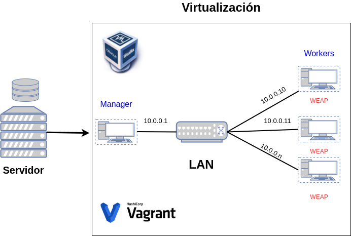

# Estrategia RDM para la generación de escenarios del modelo WEAP

La siguiente documentación forma parte del proyecto **Implementación adaptativa y robusta para los Planes de Gestión de Recursos Hídricos en las cuencas de Ligua y Petorca, Región de Valparaíso, Chile**.

El objetivo de proyecto es proponer estrategias de implementación de los PEGH con un enfoque robusto y adaptativo, mediante la utilización de RDM en las cuencas de Ligua y Petorca, región de Valparaíso, Chile. 

Para lo anterior, uno de los objetivos específicos es evaluar el desempeño e identificar vulnerabilidades del sistema actual de gestión de recursos hídricos de las cuencas Ligua y Petorca. Por otro lado, es preciso evaluar el desempeño del sistema y la mitigación de las vulnerabilidades con las alternativas propuestas en los PEGH en evaluación y otras propuestas, considerando suposiciones alternativas sobre el futuro.

Se cuenta con un Modelo WEAP-MODFLOW que representa las condiciones hidrológicas (condicionadas por clima) y la interacción hidrología superficial y subterránea. 

Se propone utilizar la metodología Robust Decision Making (RDM) para evaluar estrategias sobre las trayectorias posibles para identificar escenarios relevantes para las intervenciones en políticas públicas así como para definir estrategias adaptativas. 

## Problemática

Las ejecuciones del modelo WEAP-MODFLOW no pueden ser paralizables, lo cual significa un problema pues tiempo de ejecución de una corrida para todo el periodo (30 años) es de aproximadamente 1 hora y 30 minutos. La ejecución de modelo es completamente secuencial, pues no es posible hacer un llamado desde otro usuario del equipo. 

## Propuesta 

Se propone utilizar [Vagrant](vagrantup.com), la cual es una tecnología para la creación y configuración de desarrollo de entornos virtualizados, para construir la arquitectura virtualizada de un patron paralelo manager-workers para realizar ejecuciones paralelas del modeo WEAP-MODFLOW en distintos equipos virtuales. 

El entorno virtualizado se presenta en la siguiente figura:

Para el servicio de virtualización, se utilizará [VirtualBox](https://www.virtualbox.org/).

Los detalles de la implementación se encuentran en el directorio [vagrant](./vagrant/README.md) to visit a website.